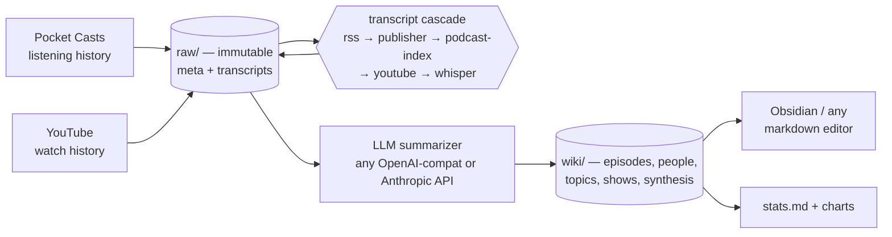

# podmind


A [Karpathy-style LLM-built knowledge wiki](https://gist.github.com/karpathy/442a6bf555914893e9891c11519de94f) of everything you actually listen to.

Pocket Casts listening history and YouTube watch history go in; an Obsidian-compatible, cross-linked markdown wiki comes out — one page per episode, plus people, topics, and show pages, listening-state badges on every citation, and an analytics layer over your listening history. The wiki compounds: every ingest and every query leaves more cross-links behind.


## How it works

Three layers, strictly separated:

1. **Raw layer** (immutable) — episode metadata + transcripts at `$PODMIND_DATA_ROOT/raw/episodes/<show>/<date-title>/`. Source of truth, never edited.
2. **Wiki layer** (LLM-curated) — markdown pages at `$PODMIND_DATA_ROOT/wiki/`. Regeneratable from raw + the schema.
3. **Schema layer** — [docs/CLAUDE-vault.md](docs/CLAUDE-vault.md), the agent instructions that define what a well-formed wiki looks like. It co-evolves with the wiki as new patterns emerge.

The Python package (this repo) is the pipeline. Your data and wiki live in a separate **vault** directory.



Every episode citation in the wiki carries a **listening-state badge** derived from the raw metadata: `🎧` fully listened, `▶ 42%` in progress, `⚪` not yet heard. That makes *"what have I actually heard about X?"* answerable with a grep — filter topic-page citations for `🎧` and you get exactly the claims you've personally listened to, not just subscribed to.

## Try it in 60 seconds (no accounts needed)

```bash
git clone https://github.com/DexMind-AI/podmind.git
cd podmind
uv sync
./scripts/demo.sh
```

Then open `examples/demo-vault/` in Obsidian (or browse `wiki/` in any markdown editor). The vault ships a graph-view config that scopes the graph to the `wiki/` layer, so you see the cross-linked output, not the raw transcripts.

The demo runs the **real pipeline** — `tick_prep.py` scans the vault for pending episodes, `tick_finalize.py` writes episode pages, people/topic stubs, the show page, the index, and a log entry — over 3 bundled synthetic episodes. The LLM summarization step is replaced by pre-baked summary JSON, so it needs zero API keys.

## Setup for real use

### Install

```bash
uv sync                      # core pipeline
uv sync --extra whisper      # + local mlx-whisper transcription (Apple Silicon)
uv sync --extra stats        # + matplotlib/pandas for the analytics charts
uv sync --extra all          # everything, incl. yt-dlp
```

### Create a vault

The vault is a plain directory with `raw/` and `wiki/` subtrees; podmind finds it via `PODMIND_DATA_ROOT`. Export it in your shell profile, or use direnv (`dotenv .env` in `.envrc`) — podmind does not auto-load `.env`. See [.env.example](.env.example).

```bash
export PODMIND_DATA_ROOT=/Users/you/my-podmind-vault
mkdir -p "$PODMIND_DATA_ROOT"/{raw/{feeds,episodes,audio},wiki/{episodes,people,topics,shows,synthesis}}
```

### Secrets

Credentials live in `~/.config/podmind/secrets.json` (override the path with `PODMIND_SECRETS`):

```bash
mkdir -p ~/.config/podmind
cat > ~/.config/podmind/secrets.json <<'EOF'
{
  "llm_api_key": "sk-..."
}
EOF
chmod 600 ~/.config/podmind/secrets.json
```

| Key | Required | Used for |
|---|---|---|
| `llm_api_key` | yes (or legacy `deepseek_api_key`) | the summarizer (`bin/summarize.py` / `bin/ingest_run.py`) |
| `pocketcasts_token` | for Pocket Casts sync | written for you by `uv run python -m podmind.pocketcasts login` |
| `podcast_index_key` / `podcast_index_secret` | optional | the podcast-index tier of the transcript cascade |
| `embed_api_key` | optional | embeddings for semantic search (`bin/embed_all.py`, `bin/query.py`) |

### LLM provider

podmind speaks two wire protocols — OpenAI-compatible `chat/completions` and the Anthropic Messages API — so any mainstream provider works. Configure via env vars (`PODMIND_LLM_PROVIDER` / `PODMIND_LLM_BASE_URL` / `PODMIND_LLM_MODEL` / `PODMIND_LLM_API_KEY`) or the equivalent `llm_*` keys in secrets.json:

| Provider | `PODMIND_LLM_PROVIDER` | `PODMIND_LLM_BASE_URL` | `PODMIND_LLM_MODEL` (example) |
|---|---|---|---|
| **DeepSeek** (default — tested, cost-measured) | `openai-compat` | `https://api.deepseek.com/v1` | `deepseek-chat` |
| OpenAI | `openai-compat` | `https://api.openai.com/v1` | `gpt-4o-mini` |
| OpenRouter | `openai-compat` | `https://openrouter.ai/api/v1` | `deepseek/deepseek-chat` |
| Ollama (local) | `openai-compat` | `http://localhost:11434/v1` | `llama3.1` |
| Anthropic | `anthropic` | `https://api.anthropic.com` | `claude-sonnet-4-6` |

With no config at all, podmind defaults to DeepSeek chat — you only need an API key. Embeddings follow the same pattern with `PODMIND_EMBED_BASE_URL` / `PODMIND_EMBED_MODEL` / `PODMIND_EMBED_API_KEY` (default: OpenRouter, `openai/text-embedding-3-small`).

### First sync

```bash
# One-time: log in to Pocket Casts (stores a token in secrets.json)
uv run python -m podmind.pocketcasts login

# Pull listening state + run the transcript cascade on a small batch first
uv run python -m podmind.sync --no-whisper --limit 10

# Summarize pending episodes into the wiki (prep → LLM → finalize)
./bin/ingest_run.py 12
```

The **transcript cascade** tries five tiers in order, cheapest first, and stops at the first hit:

1. **rss** — Podcasting 2.0 `<podcast:transcript>` tag in the show's feed
2. **publisher** — known-publisher web scrapers (often paywalled)
3. **podcast-index** — transcript URLs registered at api.podcastindex.org
4. **youtube** — yt-dlp subtitles (direct URL for YT-sourced episodes; `ytsearch1` for podcasts)
5. **whisper** — local `mlx-whisper` as last resort (Apple Silicon, `--extra whisper`)

### Automation (macOS)

```bash
PODMIND_DATA_ROOT=/Users/you/my-podmind-vault ./scripts/install_launchd.sh
```

This renders and loads two launchd jobs: a **daily 04:00 pipeline** (Pocket Casts pull → YouTube history pull → transcript cascade → LLM ingest → stats) and a long-lived **whisper loop** that drains the transcription backlog only while the Mac is on AC power.

## Pocket Casts disclaimer

Pocket Casts has no public API. podmind talks to the same private endpoints the Pocket Casts web player uses — like other open-source Pocket Casts clients. It can break without notice, and you should consider whether that's acceptable use of your account.

## Cost discipline

All numbers below are **measured**, not estimated (telemetry is written to `/tmp/podmind-results/_cost.json` after every run):

- **~$0.015/episode** fresh on DeepSeek V4 — but ~92% of that is transcript input tokens, so cost scales with transcript length, not episode count. Rule of thumb: **~$0.0675 per 1000 KB of transcript**.
- The 400 KB transcript input cap bounds worst-case per-episode cost at **~$0.027**.
- A 100-episode backlog run lands around **$1.50**.
- Whisper transcription is **free** locally on Apple Silicon (~5–7 min per 60-min episode on an M1).
- **Transcripts are stored compressed** (`transcript.vtt.xz`, xz/lzma — ~6–7×
  smaller) by default; the plain-text `transcript.md` the summarizer reads stays
  uncompressed and greppable. Disable with `PODMIND_COMPRESS_TRANSCRIPTS=0`.
  Migrate an existing vault with `./bin/compress_transcripts.py` (`--dry-run`
  to preview, `--decompress` to reverse).
- Free transcript tiers (RSS, podcast-index, YouTube subs) are always tried before whisper.

One non-obvious cost of cheap hosted models: they can quietly soften politically sensitive framings. `bin/sensitivity_audit.py` scans transcripts for China-PRC sensitive markers (Tiananmen, Xinjiang, Taiwan, CCP-critique, …) and flags episodes for optional re-summarization with a stronger model — think of it as **auditing your cheap LLM provider for censorship drift**.

## Tool reference

| Path | What it does |
|---|---|
| `podmind/sync.py` | Pocket Casts pull + transcript cascade driver |
| `podmind/transcript.py` | Cascade: rss → publisher → podcast-index → youtube → whisper |
| `podmind/youtube.py` | Google Takeout watch-history ingest |
| `podmind/youtube_history.py` | Daily yt-dlp pull from youtube.com/feed/history |
| `podmind/refresh_badges.py` | Re-derive listened-state badges on wiki pages |
| `podmind/llm.py` | Provider-agnostic LLM + embeddings client |
| `bin/ingest_run.py` | Full ingest driver: prep → LLM summarize → finalize, one command |
| `bin/summarize.py` | LLM summarization over a dispatch file (called by ingest_run) |
| `bin/tick_prep.py` | Emit next-N pending episodes as a JSON dispatch table; auto-quarantine yt-dlp duplicates |
| `bin/tick_finalize.py` | Write episode pages + stubs, regenerate `wiki/index.md`, append log entry |
| `bin/build_stats.py` | Regenerate `wiki/stats.md` + analytics PNGs |
| `bin/lint.py` | Wiki health pass: near-dup topics, broken cross-links, stale badges |
| `bin/embed_all.py` / `bin/query.py` | Embeddings + semantic query over the wiki |
| `bin/daily_digest.py` | 3-minute digest of what you listened to recently |
| `bin/merge_topic_dups.py` / `bin/merge_topic_ai.py` | Near-duplicate topic merge (heuristic / LLM-judged) |
| `bin/sensitivity_audit.py` | Flag episodes where a cheap provider may have softened sensitive framing |
| `bin/yt_prefilter.py` | Quarantine YouTube episodes not worth transcribing |
| `bin/preflight.sh` | Verify the launchd toolchain before it next fires (~47 checks) |
| `scripts/demo.sh` | Zero-key demo: real pipeline over 3 bundled synthetic episodes |
| `scripts/install_launchd.sh` | Render + load the macOS launchd jobs for unattended operation |

## The schema layer

[docs/CLAUDE-vault.md](docs/CLAUDE-vault.md) is the third layer of the system: the agent instructions a coding agent (Claude Code or similar) follows to maintain the wiki — page formats, badge rules, the ingest/query/lint operation contracts, and log-entry types. In [Karpathy's original pattern](https://gist.github.com/karpathy/442a6bf555914893e9891c11519de94f) the schema is not frozen: when an operation reveals a missing or ambiguous instruction, the agent updates the schema in the same session and logs the change. The schema is the highest-leverage file in the vault — a one-sentence fix there propagates to every future session.

## License

MIT
