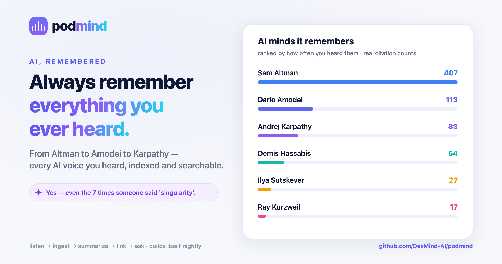
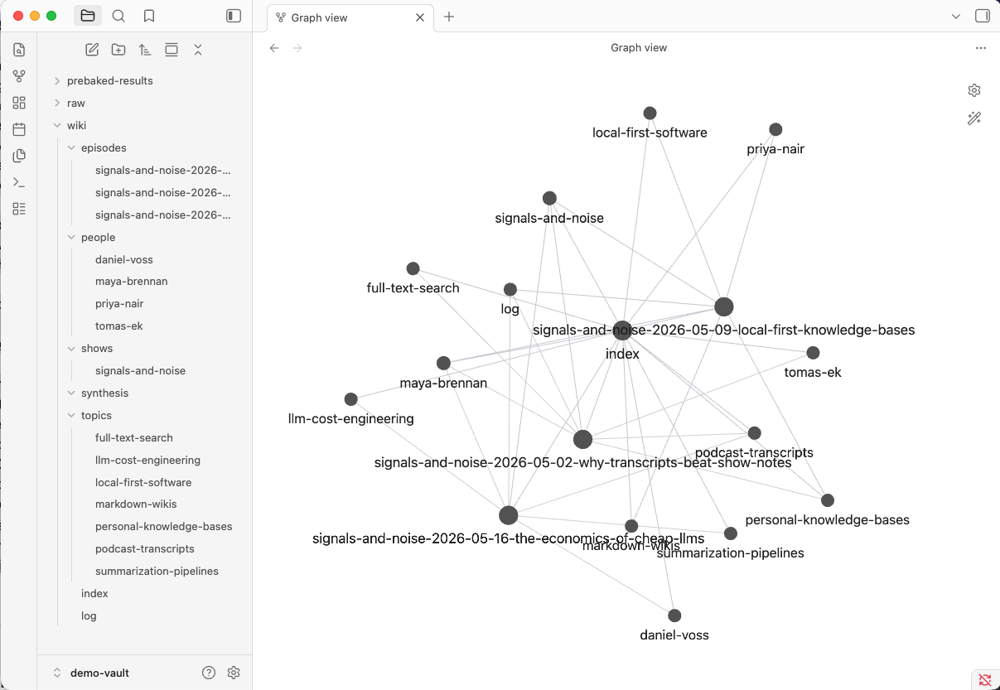
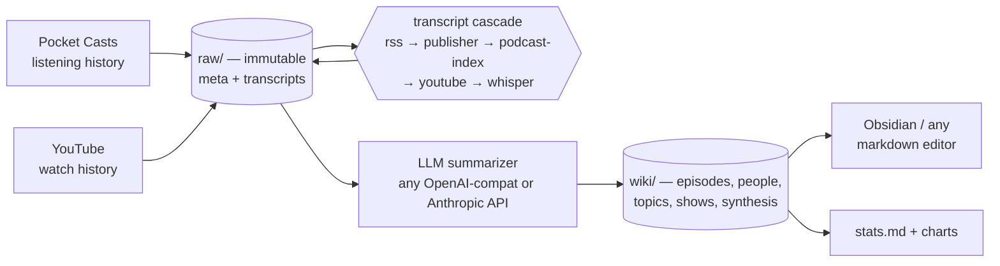

# podmind

<p align="center">
  
</p>

<p align="center"><em>Always remember everything you ever heard.</em></p>


**You've listened to thousands of hours of podcasts. Quick — what did the last one actually say?**

podmind is the memory you wish your ears had. Point it at your Pocket Casts and YouTube history and it quietly builds a [Karpathy-style LLM knowledge wiki](https://gist.github.com/karpathy/442a6bf555914893e9891c11519de94f) of everything you've *actually* heard — one cross-linked markdown page per episode, plus people, topics, and show pages, with a listening-state badge on every citation so you can tell what you truly listened to from what's just been sitting in your queue.

Listening history goes in; an Obsidian-compatible second brain comes out. And it compounds: every ingest and every query leaves more cross-links behind.



## Why podmind

- **You already did the listening — keep the knowledge.** Hours of audio leave almost no durable trace. podmind turns listening you've *already done* into something searchable.
- **Answers from your sources, not the web.** `podmind query "..."` synthesizes a cited answer from the episodes you actually heard — not a generic chatbot guess.
- **Plain markdown you own forever.** Obsidian-compatible files on your disk. Greppable, portable, and they outlive every SaaS knowledge tool.
- **It builds itself.** A daily job pulls new listens, transcribes, summarizes, and cross-links — hands-off while you sleep.
- **Cheap and local-first.** ~$0.015/episode for summaries; transcription runs free on Apple Silicon.

## What it produces

Run podmind over an episode and you get a page like this — structured takeaways, quotes with timestamps, and real cross-links, topped with a listening-state badge (`🎧` heard · `▶ 38%` in progress · `⚪` unheard):

```markdown
---
show: "Signals & Noise"
date: 2026-05-16
guests: ["Daniel Voss"]
---
▶ 38% [[shows/signals-and-noise]] — Daniel Voss on cost-per-token engineering:
your LLM bill is input tokens, and the cheapest model that emits valid JSON wins.

## Key takeaways
- Summarization cost is dominated by input tokens (~90%), so the bill scales
  with transcript length, not model intelligence.
- Three levers — truncation, prompt caching, and model routing — cut costs by
  two thirds before any prompt tuning.

## Notable quotes
> Your bill is determined by how much you make the model read, not by how smart
> it is. — Daniel Voss (00:04:10)

## Cross-links
- People: [[people/maya-brennan]], [[people/daniel-voss]]
- Topics: [[topics/llm-cost-engineering]], [[topics/summarization-pipelines]]
```

Every `[[link]]` resolves to a real page. Topic and people pages gather every episode that touched them — so *"what have I actually heard about LLM costs?"* is a grep away: filter a topic page's citations for `🎧` and you get exactly the claims you've personally listened to, not just subscribed to.

## What it looks like at scale

One real vault, built passively over ~10 years of listening:

| | |
|---|---|
| **14,789** episodes tracked | **8,789** hours of audio |
| **1,720** shows & channels | **9,376** episodes distilled into the wiki |
| **19,467** people mapped | **30,589** topics — every one cross-linked |

The busiest threads run from Bitcoin (562 citations) to AI agents (260) to geopolitics — the wiki maps whatever you actually feed it.

## How it works

Three layers, strictly separated:

1. **Raw layer** (immutable) — episode metadata + transcripts at `$PODMIND_DATA_ROOT/raw/episodes/<show>/<date-title>/`. Source of truth, never edited.
2. **Wiki layer** (LLM-curated) — markdown pages at `$PODMIND_DATA_ROOT/wiki/`. Regeneratable from raw + the schema.
3. **Schema layer** — [docs/AGENTS-vault.md](docs/AGENTS-vault.md), the agent instructions that define what a well-formed wiki looks like. It co-evolves with the wiki as new patterns emerge.

The Python package (this repo) is the pipeline. Your data and wiki live in a separate **vault** directory.



## Try it in 60 seconds (no accounts needed)

```bash
git clone https://github.com/DexMind-AI/podmind.git
cd podmind
uv sync
./scripts/demo.sh
```

Then open `examples/demo-vault/` in Obsidian (or browse `wiki/` in any markdown editor). The vault ships a graph-view config that scopes the graph to the `wiki/` layer, so you see the cross-linked output, not the raw transcripts.

The demo runs the **real pipeline** — `tick_prep.py` scans the vault for pending episodes, `tick_finalize.py` writes episode pages, people/topic stubs, the show page, the index, and a log entry — over 3 bundled synthetic episodes. The LLM summarization step is replaced by pre-baked summary JSON, so it needs zero API keys.

## Setup for real use

### Install

```bash
uv sync                      # core pipeline
uv sync --extra whisper      # + local mlx-whisper transcription (Apple Silicon)
uv sync --extra stats        # + matplotlib/pandas for the analytics charts
uv sync --extra all          # everything, incl. yt-dlp
```

### Create a vault

The vault is a plain directory with `raw/` and `wiki/` subtrees; podmind finds it via `PODMIND_DATA_ROOT`. Export it in your shell profile, or use direnv (`dotenv .env` in `.envrc`) — podmind does not auto-load `.env`. See [.env.example](.env.example).

```bash
export PODMIND_DATA_ROOT=/Users/you/my-podmind-vault
mkdir -p "$PODMIND_DATA_ROOT"/{raw/{feeds,episodes,audio},wiki/{episodes,people,topics,shows,synthesis}}
```

### Secrets

Credentials live in `~/.config/podmind/secrets.json` (override the path with `PODMIND_SECRETS`):

```bash
mkdir -p ~/.config/podmind
cat > ~/.config/podmind/secrets.json <<'EOF'
{
  "llm_api_key": "sk-..."
}
EOF
chmod 600 ~/.config/podmind/secrets.json
```

| Key | Required | Used for |
|---|---|---|
| `llm_api_key` | yes (or legacy `deepseek_api_key`) | the summarizer (`bin/summarize.py` / `bin/ingest_run.py`) |
| `pocketcasts_token` | for Pocket Casts sync | written for you by `uv run python -m podmind.pocketcasts login` |
| `podcast_index_key` / `podcast_index_secret` | optional | the podcast-index tier of the transcript cascade |
| `embed_api_key` | optional | embeddings for semantic search (`bin/embed_all.py`, `bin/query.py`) |

### LLM provider

**Default is DeepSeek — put one key in `secrets.json` and you're done.** podmind also speaks OpenAI, OpenRouter, Ollama, and Anthropic; see [docs/OPERATIONS.md](docs/OPERATIONS.md#llm-provider-configuration) for the provider matrix and embeddings config.

### First sync

```bash
# One-time: log in to Pocket Casts (stores a token in secrets.json)
uv run python -m podmind.pocketcasts login

# Pull listening state + run the transcript cascade on a small batch first
uv run podmind sync --no-whisper --limit 10

# Summarize pending episodes into the wiki
uv run podmind ingest 12
```

The **transcript cascade** tries five tiers in order, cheapest first, and stops at the first hit:

1. **rss** — Podcasting 2.0 `<podcast:transcript>` tag in the show's feed
2. **publisher** — known-publisher web scrapers (often paywalled)
3. **podcast-index** — transcript URLs registered at api.podcastindex.org
4. **youtube** — yt-dlp subtitles (direct URL for YT-sourced episodes; `ytsearch1` for podcasts)
5. **whisper** — local `mlx-whisper` as last resort (Apple Silicon, `--extra whisper`)

### Automation (macOS)

```bash
PODMIND_DATA_ROOT=/Users/you/my-podmind-vault ./scripts/install_launchd.sh
```

Loads a daily 04:00 pipeline + an AC-gated whisper loop. Details in [docs/OPERATIONS.md](docs/OPERATIONS.md#automation-macos-launchd).

## Pocket Casts disclaimer

Pocket Casts has no public API. podmind talks to the same private endpoints the Pocket Casts web player uses — like other open-source Pocket Casts clients. It can break without notice, and you should consider whether that's acceptable use of your account.

## Cost

~**$0.015/episode** on the default DeepSeek path (measured); a 100-episode run ≈ $1.50. Whisper transcription is free locally on Apple Silicon. Full breakdown in [docs/OPERATIONS.md](docs/OPERATIONS.md#cost-discipline).

## Commands

One CLI, `podmind <command>` (run `podmind <command> --help` for flags):

| Command | What it does |
|---|---|
| `podmind ingest [N]` | summarize pending episodes into the wiki |
| `podmind query <q>` | semantic query, filed back as a synthesis page |
| `podmind lint` | wiki health pass (near-dup topics, broken links, stale badges) |
| `podmind sync` | pull Pocket Casts state + run the transcript cascade |
| `podmind transcript` | transcript cascade only |
| `podmind digest` | a short digest of recent listening |
| `podmind stats` | regenerate `wiki/stats.md` + charts |
| `podmind embed` | build/refresh the semantic-search cache |
| `podmind compress-transcripts` | migrate VTT transcripts to/from xz |
| `podmind refresh-badges` | re-derive listened-state badges |
| `podmind demo` | the zero-key demo |

Operator detail — launchd automation, the provider matrix, cost deep-dive — is in [docs/OPERATIONS.md](docs/OPERATIONS.md).

## The schema layer

[docs/AGENTS-vault.md](docs/AGENTS-vault.md) is the third layer of the system: the agent instructions a coding agent (Claude Code or similar) follows to maintain the wiki — page formats, badge rules, the ingest/query/lint operation contracts, and log-entry types. In [Karpathy's original pattern](https://gist.github.com/karpathy/442a6bf555914893e9891c11519de94f) the schema is not frozen: when an operation reveals a missing or ambiguous instruction, the agent updates the schema in the same session and logs the change. The schema is the highest-leverage file in the vault — a one-sentence fix there propagates to every future session.

## License

MIT
